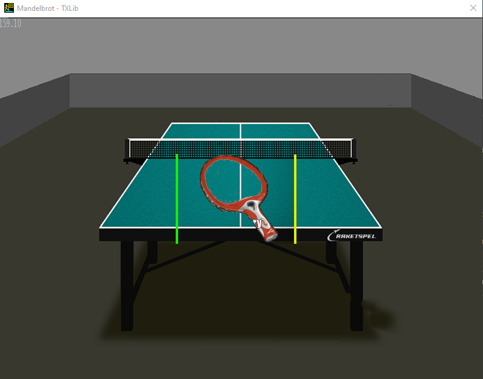

# Множество Мандельброта

<p align="center">
    
</p>

Горячие клавиши:
    1. Стрелки - перемещение картинки по экрану.
    2. `+` и `-` - увеличение / уменьшение масштаба.
    3. Нажатие клавиши `shift` + любая из предыдущих - усиление эффекта.
    4. `Esc` - закрыть программу.

`Release x64`. Чтобы минимизировать вклад отрисовки на производительность, при измерении fps задача вычисляется 100 раз, и псоле этого только 1 раз рисуется. Вычисленный при этом fps умножается на 100, т.е. fps - это количество вычислений задачи в секунду без учёта отрисовки изображения. Измерения `FPS` производились без масштабирования и перемещения изображения по экрану.

1. Оптимизациями компилятора `/O2`, `Enable intrinsic functions /Oi`, `Whole programm optimization /GL` и компоновщика `Use fast link time code generation /LTCG:incremental`:
    a) Без SSE `3,8 FPS` (double).
    б) С SSE, вычисление двух точек за раз: `6,2 FPS` (double, ускорение в 1,6 раза).
    в) С SSE, вычисление четырёх точек за раз: `14,5 FPS` (float, а поэтому выигрываем в производительности, но теряем в качестве (возможностях больше масштабировать). Ускорение в 2,3 раза по сравнению с пунктом б).

## Итого 
Вычисляя 4 точки за раз, удалось ускорить программу в 3,8 раза.

# Наложение картинок

<p align="center">
    
</p>

Картинки хранятся в формате bmp. Наложение осуществляется по формуле:
```
R = FG.R * A / 255 + BG.R * (255 - A) / 255
G = FG.G * A / 255 + BG.G * (255 - A) / 255
B = FG.B * A / 255 + BG.B * (255 - A) / 255
A = 255
```
где R, G, B - компоненты красного, зелёного и синего цветов. FG - пиксель передней картинки. BG - пиксель задней картинки.
A - прозрачность передней картинки.

Горячие клавиши:
    1. Стрелки - перемещение картинки по экрану.
    2. Нажатие клавиши `shift` - ускорение перемещения.
    3. `Esc` - закрыть программу.

`Release x64`. Чтобы минимизировать вклад отрисовки на производительность, при измерении fps задача вычисляется 1000 раз, и псоле этого только 1 раз рисуется. Вычисленный при этом fps умножается на 1000, т.е. fps - это количество вычислений задачи в секунду без учёта отрисовки изображения.

1. Оптимизациями компилятора `/O2`, `Enable intrinsic functions /Oi`, `Whole programm optimization /GL` и компоновщика `Use fast link time code generation /LTCG:incremental`:
    a) Без SSE `200 FPS`.
    б) С SSE `1200 FPS`.

## Итого
Вычисиление 4 точек за раз с помощью SSE увеличило производительность программы в 6 раз. При этом мощные оптимизации компилятора и линкера не способны так ускорить программу.
